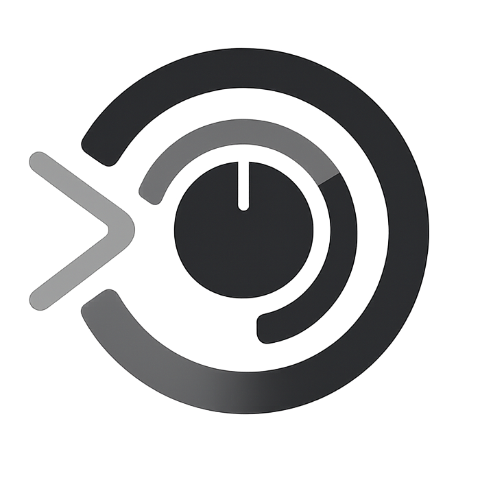

      <h1>X-1000</h1>

  
Software to simulate the Pioneer RMX-1000 X-Pads and create incredible build-ups. 
Fully mappable to MIDI controllers, featuring native Pitch and Filter effects applicable to the Roll.

